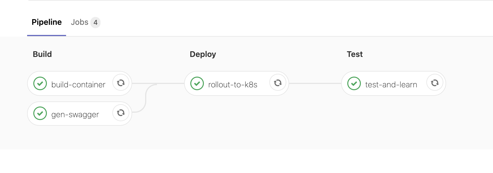

Continuous API Security Lab
===========================

Purpose
-------
The purpose of this lab is to demonstrate how  customer can implement continuos API security using Advanced WAF v16.x's declarative WAF OpenAPI extensions.

Customers can leverage a continuous integration and deployment (CI/CD) approach to ensure that as the API changes, the WAF policy is automatically updated to reflect the API's specification.

Introduction
------------
OpenAPI/Swagger (`<https://swagger.io/specification/>`_) is the "Glue" that ties together the workflow.

* Modern API's are built to be self documenting - OpenAPI specifications can be programmatically generated as part of a build pipeline. The OpenAPI specification describes the methods, endpoints, request and response formats for interfacing with the API. OpenAPI specifications are leveraged for a multitude of automation use cases as part of integration pipelines including to build automated test cases to test the API, building SDK's and clients for the API etc
* Advanced WAF's declarative policy interface (`<https://clouddocs.f5.com/products/waf-declarative-policy/declarative_policy_v16_0_0.html>`_)  provides a mechanism to manage WAF policy as a JSON/YAML specification stored in a version control repository.
* Version 16.0 of Advanced WAF introduced a capability to reference an OpenAPI spec as part of a WAF policy declaration. The WAF policy is configured to reflect and enforce positive security (endpoints, parameters e.t.c) mirroring the API definition as specified in the OpenAPI spec.

Scenario
--------

In the lab scenario - we have:
* GitLab as a source version control and CI/CD/DevOps Tool. 
* A 3 node Kubernetes cluster for hosting the containers.
* An F5 Advanced WAF instance - integrated with K8s using the F5 Container Ingress Services (CIS) `<https://clouddocs.f5.com/containers/v2/>`_ 

The lab hosts a simple REST API (beer-api) written in flask-restx (`<https://flask-restx.readthedocs.io/en/latest/>`_) - flask-restx is a commonly used python/flask based module that simplifies the creation of REST based API's. flask-restx is self documenting in that a change to the code is reflected in an automatically generated OpenAPI specification. The beer API is a simple CRUD application for storing/querying beer ratings. The API includes a SQL injection vulnerability in the GET /beer/{beer_name} endpoint.

The API's source code is checked into Gitlab as a source code repository. Gitlab is configured with a CI/CD pipeline that fires upon changes being checked into the repository. For simplicity we are operating on a single master branch committing to the production namespace) The CI/CD tasks are:
* Build a docker container incorporating the latest changes to the code and push to docker hub.
* Run the container and check the OpenAPI specification into the source code repository.
* Rollout to production K8s
* Rollout the latest revision of the container to k8s.
* Update K8s CIS config maps, service definitions and deployments - leveraging AS3 to update the beer-api application service.  CIS will apply this AS3 configuration to the BIG-IP.
* Run tests to simulate traffic against the latest rolled out version of the API.

Review the beer API source code
-------------------------------
The beer API is a very simple python flask application. You can review the source code of the beer API in GitHub. 
1. Log into GitLab using the credentials above
2. Review the beer-api project.
3. Review the files in the repository.
4. app.py is the source code for the flask-restx application. Open and review app.py.
   - Review the API model - this is a class that describes the data model for interacting with the API. Note that one of the fields (rating) is commented out.
   - Review the @ns.route, and defined procedures for handling get, post and delete methods. You can see that the implemented methods run a simple SQL query against a SQLlite database - selecting relevant data from database tables. On reviewing the /get_beer/ GET method you can see that the API takes unvalidated input and uses this input to build a SQL query - resulting in a SQL injection vulnerability. 

Interact with the beer API
--------------------------

You can interact with the beer-api bypassing any WAF protection by accessing the "Beer-API NOWAF" access methods on the F5 instance.  

Access the beer API via the UDF access method using a web browser. flask-restx provides a swagger-ux based web interface to help with interacting with the API. The swagger-ux provides a visual representation of the OpenAPI specification and can act as a client for the API.

1. Try listing the beers by clicking "Try it out", "Execute" on the GET /beers/ method.
2. Inspect the response. You should see a JSON list of beers and slogans.
3. Try searching for a beer name by clicking "Try it out" on the "GET /beers/{beer_name} method. Add a search term into the beer_name field (For example "guiness" and click "execute". The API will search the dataset for beer names matching the input string.
4  Try exploiting the SQL injection vulnerability we know exists in the GET /beers/{beer_name} method. Try adding  a' UNION SELECT * FROM CREDITCARDS-- in the search box.  The API will take this unvalidated input and create a query against the database with the following syntax "SELECT id,name,description FROM beers WHERE name LIKE 'a' a' UNION SELECT * FROM CREDITCARDS-- . The UNION keyword allows you to run an additional SELECT query and append the results to the original query.   The results of the query against the CREDITCARDS table are included in the JSON list. If you are thinking how did the attacker know there was a "CREDITCARDS" table - this can also be discovered leveraging a SQL injection vulnerability - try the search term a' UNION SELECT tbl_name,tbl_name,tbl_name FROM sqlite_master WHERE type='table' and tbl_name NOT like 'sqlite_%'-- This query will append the table names to the returned results. 

Review the pipeline configuration
---------------------------------
GitLab stores pipeline configuration in the file .gitlab-ci.yml in the project root.
1. Open the .gitlab-ci.yml file in the project root
 - There are a series of stages (build, deploy, test) that GitLab will execute upon a check in of a change to a file within the repository.
 - Each stage describes a series of commands that are run on a specified docker image:
 - The build-container stage uses kaniko (`<https://github.com/GoogleContainerTools/kaniko>`_) - Kanico will build the container (similar to running docker build . on your own docker instance) and push it to the specified repository.
 - The gen-swagger stage executes the genswagger.py script in python container - This script will extract the latest swagger OpenAPI definition from the app and check it into the GitLab source code management repository.
 - The rollout-to-k8s stage applies a configuration maps, deployments and service definitions to the K8s environment pertaining to the beer-api service. The CIS pod running in this environment will reconfigure the F5 to be consistent with the configuration expressed within these objects.
2. Inspect the configmap.yaml file in the GitLab repo - The configmap instructs CIS to apply the embedded AS3 which describes the beer-API application service.
 - NOTE: As a result of the hierarchical nature of the policy loading for AS3->Declarative WAF->OpenAPI - As part of this step we want to force reevaluation of the AS3 declaration. For scenarios where the OpenAPI specification has changed but the AS3 declaration has not CIS will not take any action, In order to force reevaluation of the AS3 when dependant files (for example the openAPI spec or declarative WAF policy) change we modify the AS3 declaration to add a comment with the commit SHA for the change. This forces CIS to reevaluate the application service definition.
3. Inspect the dec
3. Inspect the deploy.yaml and service.yaml files - These configuration objects instruct K8s to deploy 3 pods of the beer API container, to expose these pods via NodePort and for CIS to add these IP/Ports to the beer_api pool on the F5.
 - The "rollout restart deployment beerapi" command directs Kubernetes to retrieve the latest edition of the beer-api container and perform a rolling upgrade of the running containers to the latest edition. At the end of this process we sleep for 60 seconds to allow the rollout to complete.
 - The test stage generates some simple requests against the beer-api to ensure that the API is responding correctly

Review the OpenAPI swagger specification
----------------------------------------
The latest expression of the specification for the API is checked into GitLab.
1. Open the file "swagger.json" in the gitlab repo.
2. Review the contents of the swagger.json file - note the paths, data model that describes how to interface and expected responses, 

Review the F5 configuration
---------------------------
1. Log into the F5 instance
2. Navigate to the "beer-api" partition using the dropdown box 
3. Inspect the beer-API vs and beer-pool ADC objects - These objects are created by CIS based on the AS3 definition.
4. Inspect the BeerAPIWAFPolicy - This policy is crated based on the declarative WAF specification. Note the policy is an API Security Policy based on the swagger.json file.  The policy is associated with the beer-api virtual server.
5. Inspect Application Security->Allowed URLS for the policy - The allowed URL's matches paths in the OpenAPI specification.
6. Inspect Application Security->Parameters - The defined parameters match the input parameters defined in the OpenAPI specification
7. Inspect Application Security->Content Profiles->JSON Profiles - Note the defined JSON schema for the Beer API
8. Review Application Security-> Policy Building-> Learning and Blocking settings - Note that the policy enforces/blocks the above attributes.

Modify the beer-api code
------------------------

A modification of the beer-api code will kick off a pipeline that will result in the WAF policy being updated to reflect the functional change.

1. Log into GitLab
2. Select the beer-api project 
3. Edit the app.py file
4. Uncomment the delete_beer namespace definition and procedure at the bottom of the app.py file.
5. Commit your changes back to the master branch.
6. Review the CI/CD pipeline execution - CI/CD->pipelines
    - You can review the output of each job by clicking on it.
7. Once the pipeline execution is complete - You can log into the BIG-IP and review the WAF configuration.
8. Review Application Security->Allowed URLS - The new API endpoint and method we added is now reflected in the WAF policy.

Change the declarative policy from transparent to blocking
----------------------------------------------------------
The WAF policy is managed as code in the GitLab repository. The beerapi-waf-declaration.json file is an expression of the WAF policy in the declarative format. For more details on the declarative format `<https://clouddocs.f5.com/products/waf-declarative-policy/declarative_policy_v16_0_0.html>`_

1. Open beerapi-waf-declaration.json in GitLab
2. Edit the enforcementMode attribute - Replace "transparent" with "blocking"
3. Commit the chnage - the pipeline will run.
4. Once the pipeline has completed the WAF policy will now be enforcing using blocking mode.

Attempt to exploit the vulnerable API endpoint
----------------------------------------------

1. Access the Beer-API via the WAF protected policy (UDF Beer-API access method)
2. Note the new method (DELETE) that we uncommmented in the code is reflected in the App.
3. Navigate to the beer search function - Try searching for a beer name by clicking "Try it out" on the "GET /beers/{beer_name} method. Add a search term into the beer_name field (For example "guiness" and click "execute". The API will search the dataset for beer names matching the input string.
4. Try exploiting the SQL injection vulnerability we know exists in the GET /beers/{beer_name} method. Try adding  a' UNION SELECT * FROM CREDITCARDS-- in the search box. Advanced WAF will block this attempt to exploit the vulnerability resulting in a JSON formatted blocking message.

|repoinfo|

.. toctree::
   :maxdepth: 2
   :numbered:
   :caption: Contents:
   :glob:

